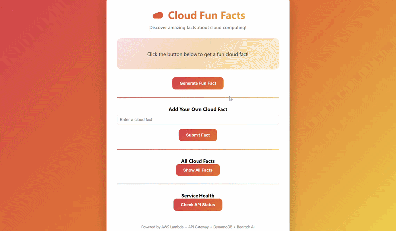
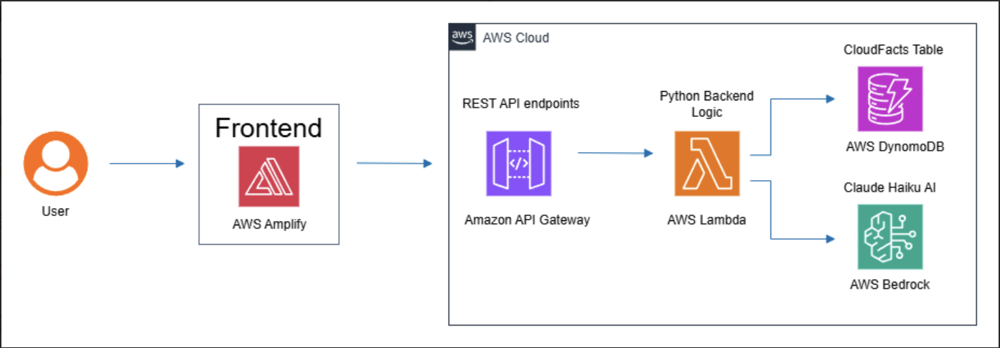

# Cloud Fun Facts Generator
Cloud Fun Facts Generator is a serverless web application built on AWS.  
It allows users to generate AI-enhanced cloud computing facts, submit new facts, view all stored facts, and check backend health status.  
The project uses AWS Amplify, API Gateway, Lambda, DynamoDB, and Amazon Bedrock.
## Demo


## Features

- Generate random cloud facts enhanced with AI
- Submit new cloud facts through the frontend
- Store facts in DynamoDB
- View all saved cloud facts
- Check API health status
- Use a serverless AWS architecture
## Architecture Diagram


## Architecture Overview

1. The user accesses the frontend hosted on AWS Amplify.
2. The frontend sends HTTP requests to Amazon API Gateway.
3. API Gateway routes requests to an AWS Lambda backend function.
4. The Lambda function processes requests and interacts with:
   - Amazon DynamoDB to store and retrieve facts
   - Amazon Bedrock to rewrite facts into more engaging responses
5. The processed result is returned to the frontend and displayed to the user.## Architecture Overview
## API Endpoints

### GET /funfact
Returns a random cloud fact enhanced with AI.

### GET /facts
Returns all cloud facts stored in DynamoDB.

### POST /fact
Adds a new cloud fact to the database.

Example request body:

```json
{
  "fact": "AWS Lambda lets you run code without managing servers."
}
```
## Tech Stack

### Frontend
- HTML
- CSS
- JavaScript

### Backend
- Python
- AWS Lambda

### AWS Services
- AWS Amplify
- Amazon API Gateway
- Amazon DynamoDB
- Amazon Bedrock
## How It Works

- The frontend is hosted using AWS Amplify.
- User actions on the page send requests to API Gateway.
- API Gateway forwards requests to AWS Lambda.
- Lambda reads and writes cloud facts in DynamoDB.
- For generated facts, Lambda sends the selected fact to Amazon Bedrock.
- Bedrock rewrites the fact in a more engaging format before it is returned to the frontend.
## Screenshots

Project screenshots will be added here.
## Credits

This project was inspired by the Cloud Fun Facts Generator tutorial from Zero to Cloud.  
The final implementation was completed independently with additional functionality and improvements, including:

- Custom frontend interface using HTML, CSS, and JavaScript
- API endpoints for retrieving facts, adding new facts, and health checks
- DynamoDB integration for persistent storage of cloud facts
- Lambda backend logic written in Python
- Amazon Bedrock integration to generate enhanced cloud facts
- Architecture diagram and project documentation

Tutorial reference:  
https://learn.zerotocloud.co/courses/cloud-fun-facts-project/lectures/63029343
## Author

Zayaan Thadathil  
Computer Science Student, University of Minnesota
